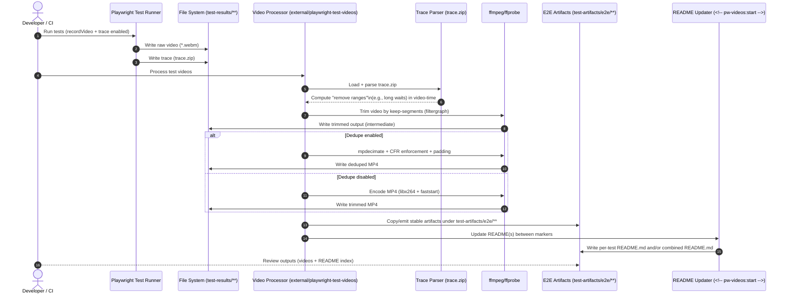

# Playwright video trimming pipeline (sequence)

> Mermaid sequence diagram for the trace-driven trimming + optional dedupe + README update flow.
>
> In VS Code: open the Markdown preview (and if needed, ensure Mermaid is enabled in your Markdown preview settings/extensions).

